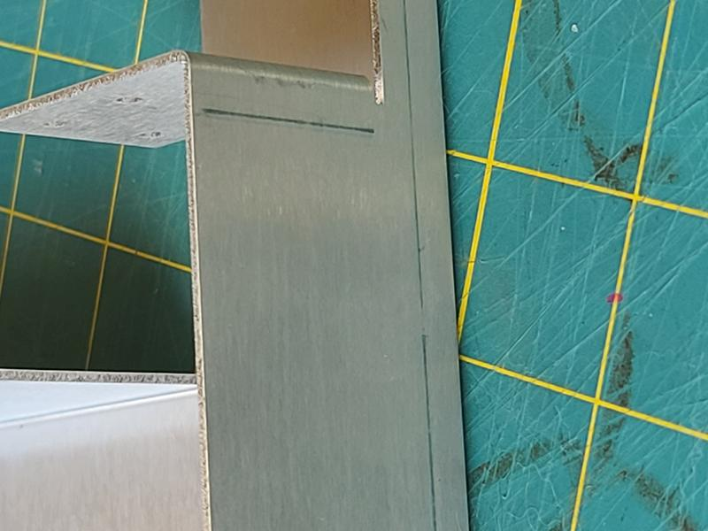

# unifi-us-xg-6poe-bracket

I have a pair of [Unifi
US-XG-6PoE](https://store.ui.com/products/us-xg-6poe) switches that I
need to mount in a 19" rack.  Unifi doesn't really make a rack mount
for them, so I ended up designing a sheet metal mount and having it
custom-bent for me.  Here's the design, if anyone needs one of their
own.

## Ordering

This is designed to be laser-cut and and folded using 1.6mm (0.063")
5052 Aluminum.  I ordered 2 from [SendCutSend](http://sendcutsend.com)
in September of 2022 for around $47 total, including shipping.

I don't have any particular relationship with SendCutSend, other than
a handful of successful orders.  There are a number of other services
that can produce this on demand online.  It's not exactly complicated,
although the clearances are kind of tight in places.

With SendCutSend, all 5 bends are folded 90 degrees *down*.  Folding
up would probably produce a mirror-image version.

## Details

This was designed in Fusion 360.  I've included a [flat
DXF](xg6poe_bracket.dxf) suitable for ordering, a Fusion 360 [.f3d
export file](xg6poe mount v1.f3d), and a [STEP model](xg6poe mount
v1.step) in the project.

You can view the [bracket online](https://a360.co/3rEbnRu) via
Autodesk's viewer.

Expect machining marks on the bracket.  Mine had several obvious marks
from the brake:

I applied a couple coats of "Aluminum" Rust-Oleum American Accents 2x
Ultra Cover Matallic Spray Paint.  Odds are any matallic silver paint
would be fine.

Here's the final model, including the power supply:

In an ideal world, I'd probably have folded the top of the power
supply mount over again, or cut holes into the base for cable ties,
but this works well enough.

The switch is held into the bracket with 8 short M3 screws. I think I
used 8mm screws, but anything short should be fine, including the
screws that come with the switch.

## Alternative

While Unifi doesn't make a rack mount for this switch, it will
supposedly fit their [EdgeMAX Universal Rack-mount Kit
(ER-RMKIT)](https://store.ui.com/collections/operator-accessories/products/edgemax-universal-rack-mount-kit),
which is only $15.  Unfortunately, it's completely unavailable at the
moment, and it doesn't include a mount for the power supply.